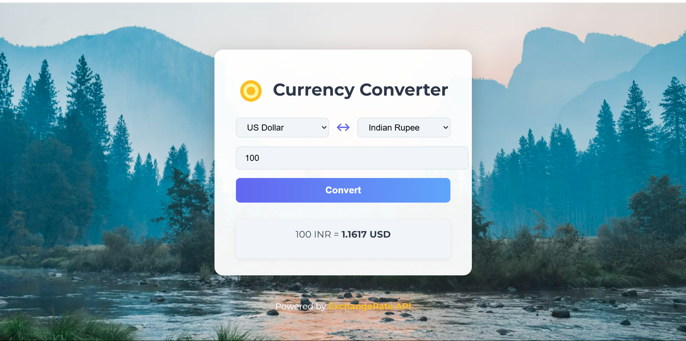
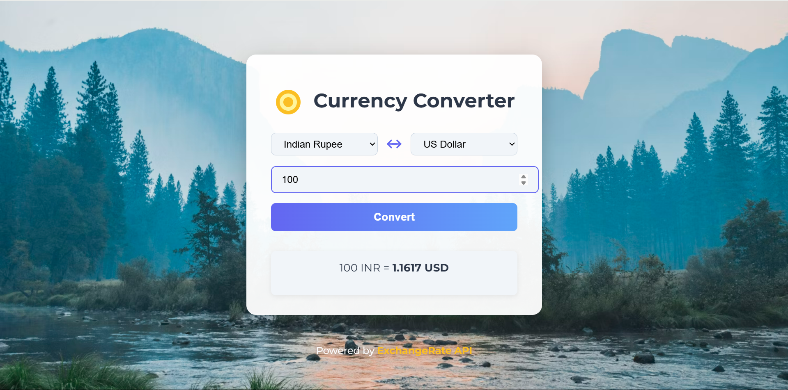

# Currency Converter

A simple and modern web-based currency converter that allows users to convert between all major world currencies using real-time exchange rates.

## Features

- Convert between 150+ world currencies
- Real-time exchange rates via open.er-api.com
- User-friendly, responsive UI
- Swap currencies with one click
- Error handling and retry option
- Modern design with smooth animations

## Screenshots

### Main UI



### Currency Dropdown Example



## How It Works

- Select the source and target currencies from the dropdowns (full currency names shown)
- Enter the amount to convert
- Click the **Convert** button to see the result instantly
- Use the swap button to quickly switch currencies

## Setup & Usage

1. **Clone the repository:**
   ```bash
   git clone <your-repo-url>
   cd currency-converter
   ```
2. **Open `index.html` in your browser.**
   - No build step or server required; works as a static site.

## Project Structure

```
currency-converter/
  ├── index.html      # Main HTML file
  ├── script.js       # JavaScript logic (API, dropdowns, conversion)
  ├── style.css       # Styles and responsive design
  ├── img/            # Project screenshots
  └── README.md       # Project documentation
```

## API Used

- [open.er-api.com](https://www.exchangerate-api.com/) for real-time currency rates

## Credits

- UI inspired by modern web design best practices
- Background image from Unsplash
- Currency names and codes from ISO 4217

## 🚀 Live Demo

Check out the live project: [globexchange.netlify.app](https://globexchange.netlify.app/)

## License

This project is open source and free to use for educational and personal purposes.
